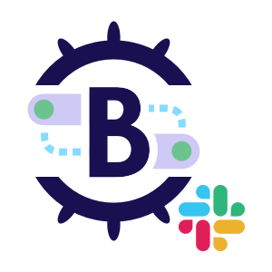

# Brigade Slack Gateway


[](https://codecov.io/gh/brigadecore/brigade-slack-gateway)
[](https://goreportcard.com/report/github.com/brigadecore/brigade-slack-gateway)
[](https://kubernetes.slack.com/messages/C87MF1RFD)



This is a work-in-progress
[Brigade 2](https://github.com/brigadecore/brigade/tree/v2)
compatible gateway that receives events from Slack slash commands and propagates
them into Brigade 2's event bus.

<br clear="left"/>

## Installation

The installation for this gateway is multi-part, and not particularly easy, at
least in part because of a potential "chicken and egg" problem. Setting up this
gateway requires values obtained during the creation of a Slack App. Setting
up the Slack App _may_ require the gateway's public IP (if you're not using a
domain or subdomain name instead). We will use an approach of setting up the
Slack App first, with a placeholder value for the gateway's address, if
necessary, in which case the Slack App configuration will be revisited after
the gateway is configured and deployed.

Prerequisites:

* A Kubernetes cluster:
    * For which you have the `admin` cluster role
    * That is already running Brigade 2
    * Capable of provisioning a _public IP address_ for a service of type
      `LoadBalancer`. (This means you won't have much luck running the gateway
      locally in the likes of kind or minikube unless you're able and willing to
      mess with port forwarding settings on your router, which we won't be
      covering here.)

* `kubectl`, `helm` (commands below require Helm 3.7.0+), and `brig` (the
  Brigade 2 CLI)

### 1. Create a Slack App

A Slack App is a special kind of trusted entity that is "installable" into a
Slack workspace to enable integrations.

This gateway can support multiple Slack Apps, but these instructions walk you
through the steps for setting up just one.

* Visit https://api.slack.com/apps. Log in if you are not logged in already.

* Click __Create New App__ and __From scratch__.

* Specify an __App Name__, select the workspace to install your new App into,
  and click __Create App__. This will create the App and take you to the App's
  own page.

* Under the heading __Add features and functionality__, click
  __Slash Commands__, and then __Create New Command__.

* Set __Command__ to be the word, with a leading slash (`/`), that should
  trigger an event. Example: `/demo`.

* Set the __Request URL__ to 
  `https://<your gateway domain or subdomain name>/slash-commands`.
    * If you're not using a domain or subdomain name and want to use a public IP
      here instead, put a placeholder such as
      `http://example.com/slash-commands` here for now and revisit this section
      later after a public IP has been established for your gateway.

* Provide a __Short Description__ of what the command will do and optionally,
  provide a __Usage Hint__.

* Click __Save__

* Return to https://api.slack.com/apps and select the App you just created.
  This will take you to the App's page.

* Under the __App Credentials__ heading, make note of the __App ID__ and
  __Signing Secret__. You will be using these values again in another step.

* Click __OAuth & Permissions__ and make note of the __Bot User OAuth Token__
  found under the __OAuth Tokens for Your Workspace__ heading. You will be using
  this value again in another step.

### 2. Create a Service Account for the Gateway

__Note:__ To proceed beyond this point, you'll need to be logged into Brigade 2
as the "root" user (not recommended) or (preferably) as a user with the `ADMIN`
role. Further discussion of this is beyond the scope of this documentation.
Please refer to Brigade's own documentation.

Using Brigade 2's `brig` CLI, create a service account for the gateway to use:

```console
$ brig service-account create \
    --id brigade-slack-gateway \
    --description brigade-slack-gateway
```

Make note of the __token__ returned. This value will be used in another step.
_It is your only opportunity to access this value, as Brigade does not save it._

Authorize this service account to read all events and to create new ones:

```console
$ brig role grant READER \
    --service-account brigade-slack-gateway

$ brig role grant EVENT_CREATOR \
    --service-account brigade-slack-gateway \
    --source brigade.sh/slack
```

__Note:__ The `--source brigade.sh/slack` option specifies that
this service account can be used _only_ to create events having a value of
`brigade.sh/slack` in the event's `source` field. _This is a
security measure that prevents the gateway from using this token for
impersonating other gateways._

### 3. Install the Slack Gateway

We're using the [GitHub Container Registry](https://ghcr.io) (which is
an [OCI registry](https://helm.sh/docs/topics/registries/)) to host our Helm
chart. Helm 3.7 has support for installing charts directly from OCI registries.

First, be sure you are using
[Helm 3.7.0](https://github.com/helm/helm/releases/tag/v3.7.0) or greater and
enable OCI support:

```console
$ export HELM_EXPERIMENTAL_OCI=1
```

As this chart requires some custom configuration, we'll need to create a chart
values file with said config.

Use the following command to extract the full set of configuration options into
a file you can modify:

```console
$ helm inspect values oci://ghcr.io/brigadecore/brigade-slack-gateway \
    --version v0.1.0 > ~/brigade-slack-gateway-values.yaml
```

Edit `~/brigade-slack-gateway-values.yaml`, making the following changes:

* `brigade.apiAddress`: Address of the Brigade API server, beginning with
  `https://`

* `brigade.apiToken`: Service account token from step 2

* `github.apps`: Specify the details of your Slack App(s), including:

    * `appID`: This is the unique ID for a Slack App. You took note of this
      value in a previous step.

    * `appSigningSecret`: This secret can be used to validate signatures on
      inbound slash commands. This is the __Signing Secret__ you took note of in
      a previous step.

    * `apiToken`: This token can be used to authenticate when sending messages
      back to Slack. This is the __Bot User OAuth Token__ you took note of in a
      previous step.

* `receiver.host`: Set this to the host name where you'd like the gateway to be
  accessible.

Save your changes to `~/brigade-slack-gateway-values.yaml` and use the following
command to install the gateway using the above customizations:

```console
$ helm install brigade-slack-gateway \
    oci://ghcr.io/brigadecore/brigade-slack-gateway \
    --version v0.1.0 \
    --create-namespace \
    --namespace brigade-slack-gateway \
    --values ~/brigade-slack-gateway-values.yaml
```

### 4. (RECOMMENDED) Create a DNS Entry

If you installed the gateway without enabling support for an ingress controller,
this command should help you find the gateway's public IP address:

```console
$ kubectl get svc brigade-slack-gateway-receiver \
    --namespace brigade-slack-gateway \
    --output jsonpath='{.status.loadBalancer.ingress[0].ip}'
```

If you overrode defaults and enabled support for an ingress controller, you
probably know what you're doing well enough to track down the correct IP without
our help. 😉

With this public IP in hand, edit your name servers and add an `A` record
pointing your domain to the public IP.

__Note:__ If you do not want to use a domain or subdomain name, or are unable
to, and elected to use a placeholder URL when initially setting up your Slack
App, return to https://api.slack.com/apps and edit your App's configuration
to send your slash command to `https://<public ip>/slash-commands`.

### 5. Add a Brigade Project

You can create any number of Brigade projects (or modify an existing one) to
listen for events that were sent from Slack to your gateway and, in turn,
emitted into Brigade's event bus. You can subscribe to all event types emitted
by the gateway, or just specific ones.

In the example project definition below, we subscribe to all events emitted by
the gateway, provided they've originated from the fictitious Slack app with the
ID `FAKEAPPID` (see the `appID` qualifier).

```yaml
apiVersion: brigade.sh/v2-beta
kind: Project
metadata:
  id: slack-demo
description: A project that demonstrates integration with Slack
spec:
  eventSubscriptions:
  - source: brigade.sh/slack
    qualifiers:
      appID: FAKEAPPID
    types:
    - "*"
  workerTemplate:
    defaultConfigFiles:
      brigade.js: |-
        const { events } = require("@brigadecore/brigadier");

        events.on("brigade.sh/slack", "demo", () => {
          console.log("Someone sent the /demo slash command!");
        });

        events.process();
```

In the alternative example below, we subscribe _only_ to `demo` events:

```yaml
apiVersion: brigade.sh/v2-beta
kind: Project
metadata:
  id: slack-demo
description: A project that demonstrates integration with Slack
spec:
  eventSubscriptions:
  - source: brigade.sh/slack
    qualifiers:
      appID: FAKEAPPID
    types:
    - demo
  workerTemplate:
    defaultConfigFiles:
      brigade.js: |-
        const { events } = require("@brigadecore/brigadier");

        events.on("brigade.sh/slack", "demo", () => {
          console.log("Someone sent the /demo slash command!");
        });

        events.process();
```

Assuming this file were named `project.yaml`, you can create the project like
so:

```console
$ brig project create --file project.yaml
```

Typing `/demo` in a Slack channel should now send an event (slash command) from
Slack to your gateway. The gateway, in turn, will emit the event into Brigade's
event bus. Brigade should initialize a worker (containerized event handler) for
every project that has subscribed to the event, and the worker should execute
the `brigade.js` script that was embedded in the project definition.

List the events for the `slack-demo` project to confirm this:

```console
$ brig event list --project slack-demo
```

Full coverage of `brig` commands is beyond the scope of this documentation, but
at this point, additional `brig` commands can be applied to monitor the event's
status and view logs produced in the course of handling the event.

## Events Received and Emitted by this Gateway

Unlike most Brigade gateways, this gateway dynamically determines the value of
the `type` field on events it emits into Brigade's event bus by simply stripping
the leading slash (`/`) from the incoming slash command.

All events are qualified by `appID` and labeled with `teamID` (workspace ID),
`channelID`, and `userID`. Qualifying events by `appID` ensures disambiguation
if you are using multiple Slack Apps that each support one or more slash
commands having the same names. Labeling events with `teamID`, `channelID`, and
`userID` enables subscriptions to optionally be very specific about what events
they're interested in.

Event payloads are composed of any text that followed the slash command when
entered by the Slack user.

Here is an abbreviated representation of a sample event emitted by this gateway:

```yaml
apiVersion: brigade.sh/v2-beta
kind: Event
metadata:
  created: "2021-09-24T20:46:47.037Z"
  id: 33b0e475-1414-4142-a682-f7b916ad2989
projectID: slack-demo
source: brigade.sh/slack
qualifiers:
  appID: A02C3GPHM6D
labels:
  channelID: C02CU7ZMJMA
  teamID: TFNLDR3SP
  userID: UGN3UHXAM
type: demo
payload: foobar
```

## Examples Projects

See `examples/` for complete Brigade projects that demonstrate various
scenarios.

## Contributing

The Brigade project accepts contributions via GitHub pull requests. The
[Contributing](CONTRIBUTING.md) document outlines the process to help get your
contribution accepted.

## Support & Feedback

We have a slack channel!
[Kubernetes/#brigade](https://kubernetes.slack.com/messages/C87MF1RFD) Feel free
to join for any support questions or feedback, we are happy to help. To report
an issue or to request a feature open an issue
[here](https://github.com/brigadecore/brigade-slack-gateway/issues)

## Code of Conduct

Participation in the Brigade project is governed by the
[CNCF Code of Conduct](https://github.com/cncf/foundation/blob/master/code-of-conduct.md).
